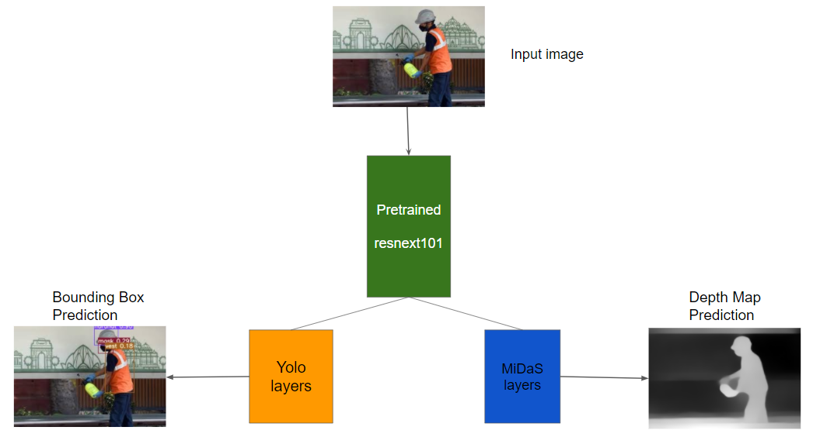
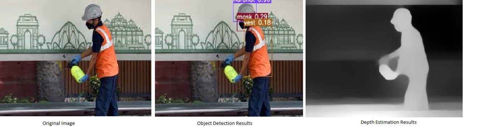

# yolo-midas

Combine YOLOv3 with MiDaS with a single Resnext101 backbone. The idea is to use a single feature extractor for two different applications, in this case, Object detection and Monocular Depth Estimation.

Please read the article to see more details https://sarvan0506.medium.com/yolo-v3-and-midas-from-a-single-resnext101-backbone-8ba42948bf65

The model architecture change can be seen in `model/mde_net.py`

## Training

The model is trained on Construction Safety Gear Data which can be found here https://github.com/sarvan0506/EVA5-Vision-Squad/tree/Saravana/14_Construction_Safety_Dataset. If training need to done on custom datasets refer the data preparation steps mentioned in the page.

Place the data inside `data/customdata/custom.data` folder

`python3.6 train.py --data data/customdata/custom.data --batch 8 --cache --cfg cfg/mde.conf --epochs 50 --img-size 512`

Please refer the config file `cfg/mde.cfg` to change the network configuration, freeze different branches. The model is an extension of YOLOv3 and MiDaS networks. Most of the configurations can be understood if familiar with

1. https://github.com/ultralytics/yolov3
2. https://github.com/intel-isl/MiDaS

## Inference

Download the weights from https://drive.google.com/drive/u/2/folders/11p7hhea2Y1FK_T5_P3W271V76IKigcUD and place it under `weights` folder

Place the images on which inference need to be run, inside `input` folder

`python3.6 detect.py --source input --conf-thres 0.1 --output output --weights weights/best.pt`

The inferred images will be stored inside `output` folder

## Inference Result Sample

